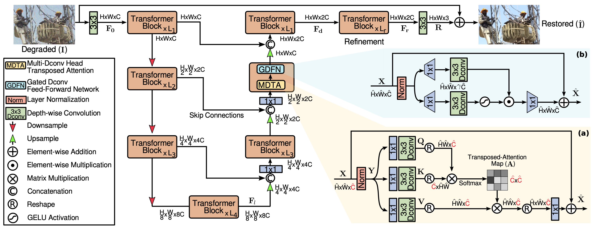

# Improving Image Denoising Performance by Data Augmentation Method

COMS 6998 Practical Deep Learning Systems Performance

Project Member: Yifan Yang (yy3185) / Zixuan Zhang (zz2888)

Affliation: Columbia Univeristy

### Table of contents
1. [Project Description](#Project-Description)
2. [Repository Description](#Repository-Description)
3. [Example and Results](#Example-and-Results)
4. [Environment Configuration](#Environment-Configuration)
5. [Quick Start](#Quick-Start)
6. [Dataset Preparation](#Dataset-Preparation)
7. [Train on PNGAN](#Train-on-PNGAN)
8. [Test on PNGAN](#Test-on-PNGAN)
8. [FineTune Restormer](#FineTune-Restormer)
8. [Test Finetuned Restormer](#Test-Finetuned-Restormer)
8. [Contribution](#Contribution)
8. [References](#References)

## Project Description

Image denoising has various applications ranging from consumer electronics to medical imaging devices. Neural methods have enjoyed great success in real noise removal in high-resolution images. However, training complex neural networks often require many clean-noisy image pairs that correctly model the underlying noise distribution. In addition, image denoising is not easily self-supervised due to the complex nature of real-world image noise. Unfortunately, training data for image denoising has been notoriously difficult and expensive to gather, with the most notable denoising datasets being [SIDD](https://www.eecs.yorku.ca/~kamel/sidd/benchmark.php) and [DND](https://noise.visinf.tu-darmstadt.de/). Neither SIDD nor DND are large datasets: SIDD contains 160 scenes with 150 similar clean-noisy image pairs for each scene captured using smartphones, and DND contains 50 clean-noisy image pairs captured using consumer-grade cameras.

Data augmentation methods in training neural networks have been proven to help improve the robustness of a model by increasing the diversity in data. Surprisingly, data augmentation in generating synthetic noisy training data has been quite tricky because real-world noise cannot be easily approximated. Naive approaches such as adding *additive white Gaussian noise* (AWGN) usually do not help improve the model performance because real-world noise is fundamentally a different distribution than Gaussian.

[Brooks et al.](https://openaccess.thecvf.com/content_CVPR_2019/papers/Brooks_Unprocessing_Images_for_Learned_Raw_Denoising_CVPR_2019_paper.pdf) and [Zamir et al.](https://arxiv.org/pdf/2003.07761.pdf) proposed noise-synthesizing methods that attempts to generate realistic noise by first converting an RGB image to a RAW image, before a non-neural RAW noise model is applied and the image is converted back to RGB. 

Taking it one step further, [Cai et al.](https://openreview.net/pdf?id=Wua2zjxJdYo) took a neural approach to realistic noise modeling and achieved impressive and ground-breaking results. They proposed a GAN architecture, namely PNGAN. They train a generator that learns to generate real noise from AWGN and a discriminator that distinguishes between real and synthetic noise. Cai et al. trained their GAN using real-noisy training data (SIDD and DND) and generated synthetic noisy-clean image pairs from high-resolution image datasets, including [DIV2K](https://data.vision.ee.ethz.ch/cvl/DIV2K/) and [Flickr2K](https://openaccess.thecvf.com/content_cvpr_2017_workshops/w12/papers/Lim_Enhanced_Deep_Residual_CVPR_2017_paper.pdf). They finetuned existing denoising models using a mixture of real-noisy data and synthetic-noisy data and observed noticeable improvements.

<p align = "center">

</p>
<p align = "center">
Figure 1. The architecture of <a href="https://openreview.net/pdf?id=Wua2zjxJdYo">Cat et al.</a>'s PNGAN 
</p>

<p align = "center">

</p>
<p align = "center">
Figure 2. Synthetic noise generated by <a href="https://openreview.net/pdf?id=Wua2zjxJdYo">Cat et al.</a>'s PNGAN vs Gaussian noise
</p>

<p align = "center">

</p>
<p align = "center">
Figure 2. Performance of PNGAN finetuned denoising models vs original
</p>

Based on this finding, we hypothesied that most current complex denoising models are under-trained due to the scarcity of training data. And the objective of this project is to implement (from scatch) the noise-synthesizing neural networks proposed by Cai et al. and generate realistic noisy training data to better improve existing denoising models, namely [Restormer](https://github.com/swz30/Restormer) proposed by [Zamir et al.](https://arxiv.org/pdf/2111.09881.pdf), which was trained using only real noisy data (SIDD). We have since observed improved denoising performance in our finetuned Restormer model.

<p align = "center">

</p>
<p align = "center">
Figure 3. The architecture of <a href="https://arxiv.org/pdf/2111.09881.pdf">Zamir et al.</a>'s Restormer
</p>

## Repository Description
- Root
  - Coordinator  # Contains the source code for self-impl parameter server
  - images  # Contains the images for readme file
  - PNGAN  # Project directory for PNGAN model
    - main.py # Main script for running the proj;
    - train.py # Trainer Class for training and testing
    - dataset # Contains code for dataset and dataloader
    - experiment # Store the trained model, log and config
    - layer  # Contains self-imple torch neural layers
    - loss  # Self-impl loss function (class)
    - model  # Contains the model impl for generator and discriminator
    - util  # Useful tools including download data, data preprocessing, etc.
  - Restomer  # The [Restormer git repo](https://github.com/swz30/Restormer)
  - Makefile  # Contains the auto run file to quick start the project
  - PNGAN_Demo_Visualization  # Jupyter notebook example to visualize PNGAN
  - Restormer_Demo_Visualization  # Jupyter notebook to visualize restormer
  - requirements.txt # Contains the required python packages and version

## Example and Results

To train our PNGAN models, we applied similar hyper-parameter settings provided by Cai et al. We trained both the generator and denoiser using the SIDD dataset. For synthetic noise settings, we used the setting1 proposed by the paper. We used the same 128x128 patch setting provided by Cai et al. We trained the model using a batch size of 8 for 60,000 iterations using Adam optimizer and cosine annealing learning rate scheduler with the same learning rate setting. All the models are trained on a single NVIDIA V100 GPU. The following figure shows an example of synthetic noise generation.

<p align = "center">

</p>
<p align = "center">
Figure 4. Synthetic noise generated by our PNGAN model (clean, Gaussian noise, PNGAN noise)
</p>

To generate synthetic clean-noisy image pairs for denoiser finetuning, we selected the [DIV2K](https://data.vision.ee.ethz.ch/cvl/DIV2K/) dataset, which is a dataset composed of diverse 2k-resolution high quality images which we consider relatively noise-free. From DIV2K, we cropped the high-resolution images to 128x128 patches and feed them through PNGAN generator to gather noisy input. We then mixed the synthetic-noisy (DIV2K-PNGAN) data with real-noisy (SIDD) data to finetune the [pretrained Restormer model](https://github.com/swz30/Restormer). We used the same AdamW optimizer provided by Restormer, and we finetuned the Restormer model for 100,800 iterations using a batch size of 4 due to the memory constraint. The following figure shows an example of the Restormer denoiser.

<p align = "center">

</p>
<p align = "center">
Figure 5. Denoising result by our finetuned Restormer model (clean, real noisy, denoised)
</p>

In benchmarks, we observed encouraging results in applying PNGAN's synthetic noisy data to finetune the Restormer denoising model. Overall, we observed meaningful performance increase in both PSNR (peak signal-to-noise ratio) and SSIM (structural simmilarity index measure) after finetuning Restormer with PNGAN-noise. To prove the effectiveness of our noise model, we also included benchmarks of the model finetuned with Gaussian noise augmented data, which shows that Gaussian noise augmentation actually degrades the performance of the original denoising model, suggesting that real noise distribution cannot be approximated with simple Gaussian noise.

|Methods|PSNR|SSIM|
|:---|:---:|:---:|
|[Restormer](https://github.com/swz30/Restormer)|40.0155|0.9602|
|[Restormer finetuned with Gaussian Noise (sigma=15)](https://storage.googleapis.com/yy3185/gaussian_finetuned_restormer.pth)|39.9931|0.9601|
|[Restormer finetuned with PNGAN Noise](https://storage.googleapis.com/yy3185/pngan_finetuned_restormer.pth)|**40.0205**|**0.9603**|

## Environment Configuration

#### Install Gdrive

Important to downlaod our pretrained model, training and testing dataset.

We provide the script to install gdrive on Linux playform.

```bash
wget https://github.com/prasmussen/gdrive/releases/download/2.1.1/gdrive_2.1.1_linux_386.tar.gz
tar -xf gdrive_2.1.1_linux_386.tar.gz
mv gdrive /usr/bin
rm gdrive_2.1.1_linux_386.tar.gz
gdrive about
```

We also provide automatically running make file (only valid for Liunx System), please run

```bash
make gdrive
```

After running the command gdrive about, you need to enter a link and finish the authentication to login a google account, so that you can use google drive services.

### Install Python Environment
All the required python packages and relevant version is in requirements.txt
```bash
pip install -r requirements.txt
```

## Quick Start

### Download Pretrained Model

#### Download RIDNet Pretrained Model

The pre-trained RIDNet denoiser is available under their [official repository](https://github.com/saeed-anwar/RIDNet).

#### Download Our trained PNGAN Model

We trained our PNGAN model using similar hyperparameters provided by the [PNGAN](https://openreview.net/pdf?id=Wua2zjxJdYo) authors on the SIDD dataset.

||Download|
|:---|:---|
|PNGAN Model|[Link](https://storage.googleapis.com/yy3185/pngan_sidd.pt)|

#### Download Our Fintuned Restormer Model

We generated synthetic clean-noisy image pairs using our trained PNGAN model from a high-resolution image dataset [DIV2K](https://data.vision.ee.ethz.ch/cvl/DIV2K/), and we finetuned our Restormer model using both the SIDD dataset and the generated DIV2K noisy dataset.

||Download|
|:---|:---|
|DIV2K-PNGAN Training Dataset|[Link](https://storage.googleapis.com/yy3185/PNGAN_train.zip)|
|Finetuned Restormer|[Link](https://storage.googleapis.com/yy3185/pngan_finetuned_restormer.pth)|

### Upload Test Images

Upload your test images (for noise generating or denoising) into the ./test directory. Results will be saved in the ./save directory.

### Generate Test Results

#### Generate the noise images

```bash
make test_pngan_with_best load_dir="../experiment/PNGAN"
```

The results will be saved in ./save/noise_gene directory.
#### Generate the denoised images

For easy visualization, please refer to our [Restormer demo Colab notebook](https://colab.research.google.com/drive/1HOwZcm8TlgS367nNS-fT6zJPUoRdZ_5_?usp=sharing). Otherwise, you would refer to the original [Restormer README](https://github.com/swz30/Restormer/blob/main/Denoising/README.md#training-1) for detailed descriptions on how to run Restormer denoiser. We provided our Restormer model checkpoint in previous sections.

## Dataset Preparation

### Download SIDD Dataset

Download SIDD Dataset into ./Downloads directory

```bash
make download_data
```

For other interests dataset downloads:

```bash
python PNGAN/util/download_data.py
	--data [str: select from 'train', 'test' or 'train-test']
	--dataset [str: select from 'SIDD' or 'DND']
	--noise	[str: select from 'real' or 'gaussian']
```

### Preprocessed Dataset

Cut images into patches with 128*128 sizes

```bash
make preprocessed
```

Crop images with other patch size, overlap size or step size:

```bash
python PNGAN/util/generate_patches_sidd.py # for sidd train dataset
	--size [int: patch size]
	--overlap [int: overlap size between patches]
	--padding [int: padding images with size]
	
python PNGAN/util/generate_patches_sidd_val.py # for sidd validation dataset
	--size [int: patch size]
	--overlap [int: overlap size between patches]
	--padding [int: padding images with size]
```

## Train on PNGAN

### Train from Scratch

```bash
make train_pngan
```

### Train with pretrained model

Please download the pretrained model firstly and save it into the directory ./experiment/PNGAN/

```bash
make train_with_best load_dir="../experiment/PNGAN"
```

### Train with Options

```bash
cd PNGAN
python main.py 
	--dir_data [str: Root Dataset Path] 
	--partial_data # Only use part training data
	--n_train [int: num of partial training data] --n_val [int: num of partial val data]
	--patch_size [int: default 128, image pathc used for training]
	--noise [int: generated guassian noise image deviation]
	--n_feats [int: hidden layer channels number used for generator]
	--epochs [int: training epochs]
	--batch_size [int: trianing batch size]
	--lr [float: default 2e-4, initial learning rate]
	--lr_min [float: minimal learning rate with lr scheduler]
	--lr_deacy_step [int: steps to drop lr from lr to lr_min]
	--load_models # load models to train
	--load_best # load the best model to train
	--load_dir [str: directory you download pretrained model]
	--load_epoch [int: provide the epoch num if you hope load from certain epoch]
	--save_models # saved the model after training
	--save [str: places you store the trained model]
```

## Test on PNGAN

### Test with pretrained model

Before you test with our pretrained model, place upload your images into ./test directory. Please with 3 channel images. The output results will be saved at ./save directory.

```bash
make test_pngan_with_best load_dir="../experiment/PNGAN"
```

### Generated Fintuned Dataset for Restormer

Generate the augemented dataset used for finetune restormer or other denoising model. The dataset will be stored into two directories: 

```bash
make generate_finetune load_dir="../experiment/PNGAN" test_path='generate data path' save_path='save data path'
```

### Test with Options

```bash
cd PNGAN
python main.py
	--test_only # Used for test
	--dir_data [str: Root Dataset Path] 
	--partial_data # Only use part training data
	--n_train [int: num of partial training data] --n_val [int: num of partial val data]
	--patch_size [int: default 128, image pathc used for training]
	--noise [int: generated guassian noise image deviation]
	--n_feats [int: hidden layer channels number used for generator]
	--epochs [int: training epochs]
	--batch_size [int: trianing batch size]
	--lr [float: default 2e-4, initial learning rate]
	--lr_min [float: minimal learning rate with lr scheduler]
	--lr_deacy_step [int: steps to drop lr from lr to lr_min]
	--load_models # load models to train
	--load_best # load the best model to train
	--load_dir [str: directory you download pretrained model]
	--load_epoch [int: provide the epoch num if you hope load from certain epoch]
```


## FineTune Restormer

### Finetune Restormer Denoiser with Real and PNGAN Noisy Images

First, follow the [installation instruction](https://github.com/swz30/Restormer/blob/main/INSTALL.md) provided by the official Restormer authors to install the depenedencies required to run Restormer.


Download the official pre-trained Restormer [models](https://drive.google.com/drive/folders/1Qwsjyny54RZWa7zC4Apg7exixLBo4uF0?usp=sharing) and place them in `./Restormer/Denoising/pretrained_models/`. Optionally, you can also download the data from shell or notebook using the mirror we provided:

```bash
wget https://storage.googleapis.com/yy3185/real_denoising.pth -O ./Restormer/Denoising/pretrained_models/real_denoising.pth
```


Download the training and validation data. We are using 128x128 RGB images.

```bash
# These commands, along with the following commands, must run in the Restormer directory
cd ./Restormer/

# Download and unzip real-noisy and fake-noisy training data, and real-noisy validation data
wget https://storage.googleapis.com/yy3185/SIDD_train_patches.zip
unzip -q SIDD_train_patches.zip -d ./Denoising/

wget https://storage.googleapis.com/yy3185/SIDD_val_patches.zip
unzip -q SIDD_val_patches.zip -d ./Denoising/

wget https://storage.googleapis.com/yy3185/PNGAN_train.zip
unzip -q PNGAN_train.zip -d ./Denoising/

# Copy all real-noisy and fake-noisy training data to one folder
mkdir -p ./Denoising/Datasets/train/PNGAN+SIDD/input_crops/
mkdir -p ./Denoising/Datasets/train/PNGAN+SIDD/target_crops/

cp -r ./Denoising/Datasets/train/PNGAN/input_crops/ ./Denoising/Datasets/train/PNGAN+SIDD/input_crops/
cp -r ./Denoising/Datasets/train/SIDD/input_crops/ ./Denoising/Datasets/train/PNGAN+SIDD/input_crops/
cp -r ./Denoising/Datasets/train/PNGAN/target_crops/ ./Denoising/Datasets/train/PNGAN+SIDD/target_crops/
cp -r ./Denoising/Datasets/train/SIDD/target_crops/ ./Denoising/Datasets/train/PNGAN+SIDD/target_crops/
```


Run the training command to start the training process. Please note that most of the configuration parameters are specified in the configuration YAML file (e.g., number of steps, learning rate, batch size, metrics, etc.), so you may read the YAML file to find more. You may also change them to run correctly in your compute (e.g., configure the number of GPUs).

```bash
python train.py -opt ./Denoising/Options/PNGANRealDenoising_Restormer.yml --pretrained_weights ./Denoising/pretrained_models/real_denoising.pth
```


Then you may evaluate using the following script.

```bash
python evaluate.py -opt ./Denoising/Options/PNGANRealDenoising_Restormer.yml --pretrained_weights ./experiment/PNGANRealDenoising_Restormer/models/net_g_latest.pth
```

### Finetune Restormer Denoiser with Real and Gaussian Noisy Images

As part of our ablation studies, we explore finetuning Restormer on the task of real noise denoising with data augmentation using simple Gaussian noise (as opposed to noise modeled by PNGAN). We generated additional clean-noise image pairs for training, by applying Gaussian noise ($\sigma=15$) on the [DIV2K](https://data.vision.ee.ethz.ch/cvl/DIV2K/) high-resolution image dataset.

```bash
# Download the additional training data
wget https://storage.googleapis.com/yy3185/Gaussian_train.zip
unzip -q Gaussian_train.zip -d ./Denoising/

# Copy the data to the training folder
mkdir -p ./Denoising/Datasets/train/Gaussian+SIDD/input_crops/
mkdir -p ./Denoising/Datasets/train/Gaussian+SIDD/target_crops/

cp -r ./Denoising/Datasets/train/Gaussian/input_crops/ ./Denoising/Datasets/train/Gaussian+SIDD/input_crops/
cp -r ./Denoising/Datasets/train/SIDD/input_crops/ ./Denoising/Datasets/train/Gaussian+SIDD/input_crops/
cp -r ./Denoising/Datasets/train/Gaussian/target_crops/ ./Denoising/Datasets/train/Gaussian+SIDD/target_crops/
cp -r ./Denoising/Datasets/train/SIDD/target_crops/ ./Denoising/Datasets/train/Gaussian+SIDD/target_crops/
```


Run the training command as follows:

```bash
python train.py -opt ./Denoising/Options/GaussianRealDenoising_Restormer.yml --pretrained_weights ./Denoising/pretrained_models/real_denoising.pth
```


Evaluate using the following command:

```bash
python evaluate.py -opt ./Denoising/Options/GaussianRealDenoising_Restormer.yml --pretrained_weights ./experiment/GaussianRealDenoising_Restormer/models/net_g_latest.pth
```

## Test Finetuned Restormer

To establish our baseline, we show the performance of the pre-trained Restormer denoiser on the [SIDD real-noisy dataset](https://www.eecs.yorku.ca/~kamel/sidd/dataset.php). The original evaluation [script](https://github.com/swz30/Restormer/blob/main/Denoising/evaluate_sidd.m) calls for Matlab, but we provided a Python alternative.

To prepare data, download and unzip the SIDD eval dataset.

```bash
wget https://storage.googleapis.com/yy3185/SIDD_val_patches.zip
unzip -q SIDD_val_patches.zip -d ./Denoising/
```

Then, download the the official pre-trained Restormer [checkpoint](https://drive.google.com/drive/folders/1Qwsjyny54RZWa7zC4Apg7exixLBo4uF0?usp=sharing) and place them in `./Restormer/Denoising/pretrained_models/`
    - Optionally, you can also download the data from shell or notebook using the mirror we provided:

```bash
wget https://storage.googleapis.com/yy3185/real_denoising.pth -O ./Restormer/Denoising/pretrained_models/real_denoising.pth
```

Then you may evaluate using the following script.

```bash
python evaluate.py -opt ./Denoising/Options/RealDenoising_Restormer.yml --pretrained_weights ./Denoising/pretrained_models/real_denoising.pth
```

## Contribution
1. Implement the PNGAN code, train the model and provide our pretrained models on GitHub. Provide easy scripts for others to re-run.

2. Provide a method to conduct data augmentation with less confidential images for fine-tuning a model.

3. Provide a solution (flask parameter server ) and codes for students (lack computation power) to corroborate GPU between Google Colab sessions. The server is robust and easy to configure.

4. We fine-tuned the restormer and successfully improved the performance. We proved that our assumption of a lack data training and our data augmentation method is valid.

## References
[1] Abdelhamed, A., Lin, S., & Brown, M. S. (2018). A high-quality denoising dataset for smartphone cameras. In Proceedings of the IEEE Conference on Computer Vision and Pattern Recognition (pp. 1692-1700).

[2] Plotz, T., & Roth, S. (2017). Benchmarking denoising algorithms with real photographs. In Proceedings of the IEEE conference on computer vision and pattern recognition (pp. 1586-1595).

[3] Zamir, S. W., Arora, A., Khan, S., Hayat, M., Khan, F. S., Yang, M. H., & Shao, L. (2020). Cycleisp: Real image restoration via improved data synthesis. In Proceedings of the IEEE/CVF Conference on Computer Vision and Pattern Recognition (pp. 2696-2705).

[4] Brooks, T., Mildenhall, B., Xue, T., Chen, J., Sharlet, D., & Barron, J. T. (2019). Unprocessing images for learned raw denoising. In Proceedings of the IEEE/CVF Conference on Computer Vision and Pattern Recognition (pp. 11036-11045).

[5] Cai, Y., Hu, X., Wang, H., Zhang, Y., Pfister, H., & Wei, D. (2021). Learning to generate realistic noisy images via pixel-level noise-aware adversarial training. Advances in Neural Information Processing Systems, 34.

[6] Anwar, Saeed, and Nick Barnes. "Real image denoising with feature attention." Proceedings of the IEEE/CVF international conference on computer vision. 2019.
